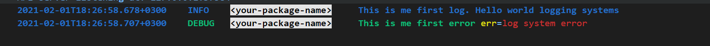

# Logos: like log4j, but for golang.

[![go.dev][pkg-img]][pkg] [![goreport][report-img]][report] [![build][build-img]][build] [![coverage][cov-img]][cov] ![stability-stable][stability-img]

## Features

This project is a wrapper around the excellent logging framework zap.

* Dependency
    - `go.uber.org/zap` for logging
    - `github.com/elastic/go-ucfg` for config logging system
* Simple and Clean Interface
* Config from file & env
* [Jobs & Timing events][jobs-timing-events] 
* One log manager for all logs
* Hot config update from file or env
* Appenders
    - `Console`, *write to console*
    - `File`, *any log file*
    - `GelfUpd`, *greylog logger*
    - `RollingFile`, *rolling file writing & compress*
* Encoders
    - `Console`, *colorful & formatting text for console*
    - `Gelf`, *gelf for greylog*
    - `Json`, *standard json encoder*
* Useful utility function
    - `Setlevel(LogName string, level int)`, *hot update logger level*
    - `UpdateLogger(LogName string, logger *zap.Logger*)`, *hot update core logger*
    - `RedirectStdLog()`, *redirect standard log package*
* High Performance
    - [Significantly faster][high-performance] json loggers.

## How to use

### Quick start

```go
package main

import (
  
  "github.com/khorevaa/logos"
)

func main() {

  log := logos.New("<your-package-name>") // like github.com/khorevaa/logos
  log.Info("This is me first log. Hello world logging systems")


}

```
### Setup config

Logos loads configuration file from system environment variable `LOGOS_CONFIG_FILE`.
If the variable is unset, then Logos will try to load the configuration file from current work directory, the file name is "logos.yaml" or "logos.yml".

Additionally, the configuration is loaded from the environment variable `LOGOS_CONFIG` adn connects to the configuration obtained from the file and takes precedence over its data.

#### From file

```yaml
appenders:
  console:
    - name: CONSOLE
      target: stdout
      encoder:
        console:
          
  file:
    - name: FILE
      file_name: /tmp/app.log
      encoder:
        json:
  gelf_udp:
    - name: GRAYLOG
      host: 127.0.0.1
      port: 12201
      compression_type: none
      encoder:
        gelf:
          key_value_pairs:
            - key: env
              value: ${ENV:dev}
            - key: app
              value: ${APPNAME:demo}
            - key: file
              value: app.log
  rolling_file:
    - name: GELF_FILE
      file_name: /tmp/app_gelf.log
      max_size: 100
      encoder:
        gelf:
          key_value_pairs:
            - key: env
              value: ${ENV:dev}
            - key: app
              value: ${APPNAME:demo}
            - key: file
              value: app.log
loggers:
  root:
    level: info
    appender_refs:
      - CONSOLE
  logger:
    - name: helloworld
      appender_refs:
        - CONSOLE
        - FILE
        - GELF_FILE
        - GRAYLOG
      level: debug      
```

#### From ENV

```bash

# Setup all logs level DEBUG
export LOGOS_CONFIG=loggers.root.level=debug

# Add new appender and setup it to logger
export LOGOS_CONFIG="appenders.console.0.name=CONSOLE_TEST;
appenders.console.0.target=stdout;
appenders.console.0.no_color=true;
appenders.console.0.encoder.console;
loggers.logger.0.add_caller=true;
loggers.logger.0.level=debug;
loggers.logger.0.name=github.com/khorevaa/logos;
loggers.logger.0.appender_refs.0=CONSOLE_TEST"


```

### Json Writer

To log a machine-friendly, use `json`.

```go
package main

import (
  "errors"
  "github.com/khorevaa/logos"
)

func main() {
	
	rawConfig := `
appenders:
  console:
    - name: CONSOLE
      target: stdout
      encoder:
        json:

loggers:
  root:
    level: info
    appender_refs:
      - CONSOLE
`
	
    logos.InitWithConfigContent(rawConfig)	
	
    log := logos.New("<your-package-name>") // like github.com/khorevaa/logos
    log.Info("This is me first log. Hello world logging systems")


}
```

### Pretty Console Writer

To log a human-friendly, colorized output, use `Console`. 

```go
package main

import (
  "errors"
  "github.com/khorevaa/logos"
)

func main() {

  rawConfig := `
appenders:
  console:
    - name: CONSOLE
      target: stdout
      encoder:
        console:
          color_scheme:
            info_level: blue+b
            debug_level: green+b

loggers:
  root:
    level: debug
    appender_refs:
      - CONSOLE
`

  logos.InitWithConfigContent(rawConfig)

  log := logos.New("<your-package-name>") // like github.com/khorevaa/logos
  log.Info("This is me first log. Hello world logging systems")

  err := errors.New("log system error")
  log.Debug("This is me first error", logos.Any("err", err))

}
```

> Note: pretty logging also works on windows console

### Jobs and Timing events

Jobs serve three functions:

* Jobs record a timing (eg, it took 21ms to complete this job)
* Jobs record a status (eg, did the job complete successfully or was there an error?)
* Jobs group instrumentation inside that job together so that you can analyze it later.

Let's say you're writing a web service that processes JSON requests/responses. You might write something like this:

```go
import (
	"github.com/khorevaa/logos"
	"net/http"
)
var log = logos.New("github.com/khorevaa/rest-api") // like github.com/khorevaa/logos
func main() {
	// setup stream with sinks
	stream.AddSink(&health.WriterSink{os.Stdout})
	http.HandleFunc("/users", getUsers)
}

func getUsers(rw http.ResponseWriter, r *http.Request) {
	// All logging and instrumentation should be within the context of a job!
	job := log.Job("get_users")

	err := fetchUsersFromDatabase(r)
	if err != nil {
		// When in your job's context, you can log errors, events, timings, etc.
		job.EventErr("fetch_user_from_database", err)
	}

	// When done with the job, call job.Complete with a completion status.
	if err == nil {
		job.Complete(logos.Success)
	} else {
		job.Complete(logos.Err)
	}
}
```

There are five types of completion statuses:

* Success - Your job completed successfully.
* Error - Some library call resulted in an error that prevented you from successfully completing your job.
* Panic - Some code paniced!
* ValidationError - Your code was fine, but the user passed in bad inputs, and so the job wasn't completed successfully.
* Junk - The job wasn't completed successfully, but not really because of an Error or ValidationError. For instance, maybe there's just a 404 (not found) or 401 (unauthorized) request to your app. This status code might not apply to all apps.

To log a jobs and events, use `Job`.

```go
package main

import (
  "errors"
  "github.com/khorevaa/logos"
)

func main() {

  var err error
  log := logos.New("<your-package-name>") // like github.com/khorevaa/logos
  log.Info("This is me first log. Hello world logging systems")

  job := log.Job("get_users")
  
  job.Event("connecting to bd")
  // do connection
  
  if err != nil {
    err = job.EventErr("connecting to bd", err)
    panic(err)
  }

  // When done with the job, call job.Complete with a completion status.
  if err == nil {
    job.Complete(logos.Success)
  } else {
    job.Complete(logos.Err)
  }
  
  err = errors.New("log system error")
  log.Debug("This is me first error", logos.Any("err", err))

}
```
#### Events, Timings, Gauges, and Errors

Within jobs, you can emit events, timings, gauges, and errors. The first argument of each of these methods is supposed to be a key.
Camel case with dots is good because it works with other metrics stores like StatsD. 
Each method has a basic version as well as a version that accepts keys/values.

##### Events & Errors

Events emitting:
```go
// Events. Notice the camel case with dots.
// (This is helpful when you want to use StatsD sinks)
job.Event("starting_server")
job.Event("proccess_user.by_email.gmail")

// Event with keys and values:
job.EventKv("failover.started", logos.Kvs{"from_ip": fmt.Sprint(currentIP)})
```
Errors emitting:
```go
// Errors:
err := someFunc(user.Email)
if err != nil {
	return job.EventErr("some_func", err)
}

// And with keys/Values:
job.EventErrKv("some_func", err, logos.Kvs{"email": user.Email})
```
##### Gauges

```go
// Gauges:
job.Gauge("num_goroutines", numRunningGoroutines()) 

// Timings also support keys/values:
job.GaugeKv("num_goroutines", numRunningGoroutines(),
	logos.Kvs{"dispatcher": dispatcherStatus()})
```

##### Timing 
```go
// Timings:
startTime := time.Now()
// Do something...
job.Timing("fetch_user", time.Since(startTime).Nanoseconds()) // NOTE: Nanoseconds!

// Timings also support keys/values:
job.TimingKv("fetch_user", time.Since(startTime).Nanoseconds(),
logos.Kvs{"user_email": userEmail})
```

#### Keys and Values

Most objects and methods in `Job` work with key/value pairs. Key/value pairs are just maps of strings to strings. Keys and values are only relevant right now for logging sinks: The keys and values will be printed on each line written.

You can add keys/values to a job. This is useful for things like hostname or pid. They keys/values will show up on every future event/timing/error.
```go
 log := logos.New("<your-package-name>")
 job := log.Job(map[string]string{
 	"hostname": hostname,
 	"pid": pid,
})

```
or 
```go
 log := logos.New("<your-package-name>")
 job := log.Job()
 job.KeyValue("hostname", hostname)
 job.KeyValue("pid", pid)

```

### High Performance

A quick and simple benchmark with zap/zerolog, which runs on [github actions][benchmark]:

```go
// go test -v -cpu=4 -run=none -bench=. -benchtime=10s -benchmem log_test.go
package main

import (
	"io/ioutil"
	"testing"

	"github.com/khorevaa/logos"
	"github.com/phuslu/log"
	"github.com/rs/zerolog"
	"go.uber.org/zap"
	"go.uber.org/zap/zapcore"
)

var fakeMessage = "Test logging, but use a somewhat realistic message length. "

func BenchmarkLogos(b *testing.B) {

	const newConfig = `
appenders:
  console:
    - name: CONSOLE
      target: discard
      encoder:
        console:
loggers:
  root:
    level: info
    appender_refs:
      - CONSOLE
`
	err := logos.InitWithConfigContent(newConfig)
	if err != nil {
		panic(err)
	}

	logger := logos.New("benchmark")
	for i := 0; i < b.N; i++ {
		logger.Info(fakeMessage, zap.String("foo", "bar"), zap.Int("int", 42))
	}
}

func BenchmarkZap(b *testing.B) {
	logger := zap.New(zapcore.NewCore(
		zapcore.NewJSONEncoder(zap.NewProductionEncoderConfig()),
		zapcore.AddSync(ioutil.Discard),
		zapcore.InfoLevel,
	))
	for i := 0; i < b.N; i++ {
		logger.Info(fakeMessage, zap.String("foo", "bar"), zap.Int("int", 42))
	}
}

func BenchmarkZeroLog(b *testing.B) {
	logger := zerolog.New(ioutil.Discard).With().Timestamp().Logger()
	for i := 0; i < b.N; i++ {
		logger.Info().Str("foo", "bar").Int("int", 42).Msg(fakeMessage)
	}
}

func BenchmarkPhusLog(b *testing.B) {
	logger := log.Logger{
		TimeFormat: "", // uses rfc3339 by default
		Writer:     log.IOWriter{ioutil.Discard},
	}
	for i := 0; i < b.N; i++ {
		logger.Info().Str("foo", "bar").Int("int", 42).Msg(fakeMessage)
	}
}


```
A Performance result as below, for daily benchmark results see [github actions][benchmark]
```

```


[pkg-img]: http://img.shields.io/badge/godoc-reference-5272B4.svg
[pkg]: https://godoc.org/github.com/khorevaa/logos
[report-img]: https://goreportcard.com/badge/github.com/khorevaa/logos
[report]: https://goreportcard.com/report/github.com/khorevaa/logos
[build-img]: https://github.com/khorevaa/logos/workflows/goreleaser/badge.svg
[build]: https://github.com/khorevaa/logos/actions
[cov-img]: http://gocover.io/_badge/github.com/khorevaa/logos
[cov]: https://gocover.io/github.com/khorevaa/logos
[stability-img]: https://img.shields.io/badge/stability-stable-green.svg
[high-performance]: https://github.com/khorevaa/logos#high-performance
[jobs-timing-events]: https://github.com/khorevaa/logos#jobs-and-timing-events
[play-simple-img]: https://img.shields.io/badge/playground-NGV25aBKmYH-29BEB0?style=flat&logo=go
[play-simple]: https://play.golang.org/p/NGV25aBKmYH2
[play-customize-img]: https://img.shields.io/badge/playground-emTsJJKUGXZ-29BEB0?style=flat&logo=go
[play-customize]: https://play.golang.org/p/emTsJJKUGXZ2
[play-file-img]: https://img.shields.io/badge/playground-nS--ILxFyhHM-29BEB0?style=flat&logo=go
[play-file]: https://play.golang.org/p/nS-ILxFyhHM
[play-pretty-img]: https://img.shields.io/badge/playground-SCcXG33esvI-29BEB0?style=flat&logo=go
[play-pretty]: https://play.golang.org/p/SCcXG33esvI2
[pretty-img]: https://user-images.githubusercontent.com/195836/101993218-cda82380-3cf3-11eb-9aa2-b8b1c832a72e.png
[play-formatting-img]: https://img.shields.io/badge/playground-UmJmLxYXwRO-29BEB0?style=flat&logo=go
[play-formatting]: https://play.golang.org/p/UmJmLxYXwRO
[play-context-img]: https://img.shields.io/badge/playground-oAVAo302faf-29BEB0?style=flat&logo=go
[play-context]: https://play.golang.org/p/oAVAo302faf
[play-marshal-img]: https://img.shields.io/badge/playground-NxMoqaiVxHM-29BEB0?style=flat&logo=go
[play-marshal]: https://play.golang.org/p/NxMoqaiVxHM
[play-interceptor]: https://play.golang.org/p/upmVP5cO62Y
[play-interceptor-img]: https://img.shields.io/badge/playground-upmVP5cO62Y-29BEB0?style=flat&logo=go
[benchmark]: https://github.com/khorevaa/logos/actions?query=workflow%3Abenchmark
[zerolog]: https://github.com/rs/zerolog
[glog]: https://github.com/golang/glog
[quicktemplate]: https://github.com/valyala/quicktemplate
[gjson]: https://github.com/tidwall/gjson
[zap]: https://github.com/uber-go/zap
[lumberjack]: https://github.com/natefinch/lumberjack
